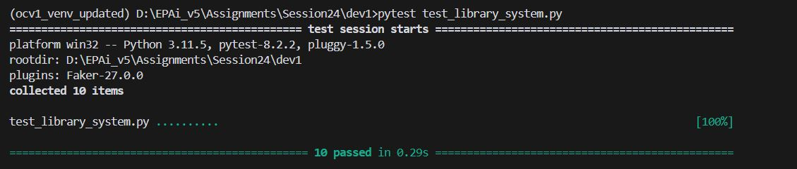
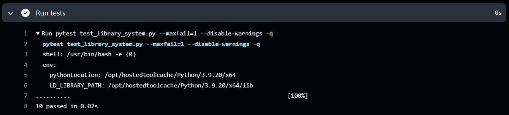

# EPAiV5-Session24 - Enumerations & Exceptions


## Library Management System

### Overview
This Python code represents a foundational library management system designed for managing books, library members, and their interactions. The code includes functionality for handling book genres, membership levels, borrowing and returning books, and custom exceptions for error handling. Below, you will find a detailed explanation of the components, their purpose, and how to use them.

### Features

#### 1. Enumeration of Book Genres and Membership Levels:

- Predefined `BookGenre` and `MembershipLevel` enums categorize books and membership tiers.
- Ensures consistency in the classification of library resources and member privileges.

#### 2. Custom Exceptions:

- `BookNotAvailableError`: Raised when a book is unavailable for borrowing.
- `LateReturnError`: Raised when a book is returned late.
- `InvalidMembershipError`: Raised for invalid membership levels.
- These exceptions improve error reporting and handling in library operations.

#### 3. Core Classes:

- `Book`: Represents a book in the library with attributes like title, genre, and availability.
- `Member`: Represents a library member with attributes such as name and membership level.

#### 4. Key Operations:

- Borrowing and returning books with error handling for unavailable books or late returns.
- Retrieving membership fees based on the membership level.

### Usage
#### 1. Enumerations
##### Book Genres

The `BookGenre` enum defines five genres:

- `FICTION`
- `NON_FICTION`
- `SCIENCE`
- `HISTORY`
- `BIOGRAPHY`

##### Membership Levels

The `MembershipLevel` enum defines three tiers with associated fees:

- `BASIC`: Fee = 100
- `PREMIUM`: Fee = 200
- `GOLD`: Fee = 500

#### 2. Creating a Book

Create a `Book` instance by providing a title, genre, and optional availability status:


```
from enum import Enum
from your_library_file import Book, BookGenre

book = Book(title="1984", genre=BookGenre.FICTION)

```

#### 3. Borrowing and Returning Books

Borrow a book using the `borrow` method:

```
book.borrow()  # Marks the book as borrowed.

```

Return a book using the `return_book` method:

```
book.return_book(is_late=False)  # Marks the book as returned.

```

Handle errors for unavailable books or late returns:


```
try:
    book.borrow()
except BookNotAvailableError as e:
    print(e)

try:
    book.return_book(is_late=True)
except LateReturnError as e:
    print(e)

```

#### 4. Creating a Library Member

Create a `Member` instance with a name and membership level:

```
from your_library_file import Member, MembershipLevel

member = Member(name="Alice", membership_level=MembershipLevel.PREMIUM)

```

#### 5. Retrieving Membership Fees

Retrieve the annual fee for a member using the `get_fee` method:

```
fee = member.get_fee()
print(f"Annual Fee: {fee}")

```

Handle invalid membership levels:


```
try:
    member = Member(name="Bob", membership_level="INVALID_LEVEL")
    fee = member.get_fee()
except InvalidMembershipError as e:
    print(e)

```

### Code Structure

#### 1. Enumerations:

- `BookGenre`: Defines the genres for books.
- `MembershipLevel`: Defines membership levels and their associated fees.

#### 2. Exceptions:

- `BookNotAvailableError`: Raised when attempting to borrow an unavailable book.
- `LateReturnError`: Raised when a book is returned late.
- `InvalidMembershipError`: Raised when an invalid membership level is encountered.

#### 3. Classes:

- `Book`: Handles book-related operations such as borrowing and returning.
- `Member`: Manages member-related data and retrieves membership fees.

### Error Handling

The system includes custom exceptions to handle common library scenarios:

- `BookNotAvailableError`: Prevents borrowing unavailable books.
- `LateReturnError`: Notifies of late returns and potential penalties.
- `InvalidMembershipError`: Ensures valid membership levels.

---

### Test Results

#### Local PC Test Execution



#### Workflow Actions




---

### Future Enhancements

- Add a library inventory system to manage multiple books and members.
- Implement features like book reservations, overdue fee calculation, and notifications.
- Develop a user-friendly interface for library administrators and members.

### Conclusion

This library management system is a scalable foundation for building advanced library solutions. It can be integrated with larger systems or used for educational purposes to learn object-oriented programming and error handling in Python.


---------------------------------------------------------------------------------------------------------------------------------------------------

**Submission by** - Hema Aparna M

**mail id** - mhema.aprai@gmail.com

---------------------------------------------------------------------------------------------------------------------------------------------------